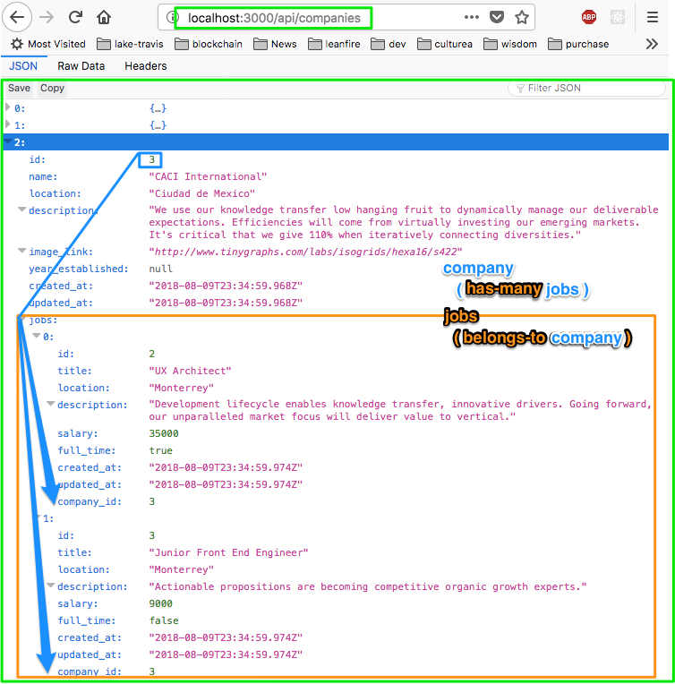

# Full Stack JS Project - Models + Relations
**`fullstack-js-05-models-relations`**


## Context
You are going to build a full stack web application with node.js + React. In order to become familiar with how a node project works, you will be responsible for configuring the  initial major components of the project.  

- express server
- application routes
- views
- api layer
  - data access [this assignment]
  - **data models + relations (ORM)**
  - RESTful routes


## The Assignment
For this assignment, we will focus on configuring the **models** and **relations** in our application through an ORM (object relational mapper).

Instead of doing SQL queries, we typically interact with an ORM module that provides us with a 'model' of each table. A model is simply an object-oriented representation of a database table. The ORM module we are using is called  [objection.js](http://vincit.github.io/objection.js/#models), and as you complete this assignment, you will see that it provides utility methods for fetching, inserting, and deleting data as well as providing helper methods for combining queries on our database tables.

###  Overview
The goal of this assignment is to query the data in the job and company tables using Models and return data as json when one accesses the `api/jobs`(demos/api-jobs.png) / `api/companies`(demos/api-companies.png) routes.


### Requirements

**Summary of primary tasks:**

- Configure the data access library (knex) with the ORM (objection).
- Declare Job and Company models in a `src/models/` folder.
- Query the database using `Job` and `Company` models
- Create a database migration to put a foreign key on the job table (for the company_id).
- Seed jobs data
- Declare the relationships between the `Company` and `Job` models
- Return jobs/company records as json in the `api/jobs` and `api/companies` routes
- Company records should show related job records.


In order to complete this assignment, you will need to:

- [x] **Install dependencies**
  - objection
  ```
  npm install --save objection
  ```

- [x] **Create relevant files/folders**
  + add a `models/` directory to `src/`
  + add a `Job.js` file to `src/models/`
  + add a `Company.js` file to `src/models/`

- [x] **Configure objection with knex**
  + in `server.js`

  ```js
  const { Model } = require('objection');

  // ........
  Model.knex(«..appDbInstance..»)
  ```


- [x] **Declare Model classes + export**
  - Create a Job [model class](http://vincit.github.io/objection.js/#models) in `Job.js`
  - Create a Company [model class](http://vincit.github.io/objection.js/#models) in `Company.js`


- [x] **Generate a database migration to create the jobs table**
  + Columns for this migration:
  ```
  id            -   integer (auto increments)
  title         -   string
  description   -   text
  location      -   string
  salary        -   salary
  full_time     -   boolean
  ```

- [x] **Generate a database migration and put the foreign key on jobs table**
  + A company has many jobs, and we need to tell our database about that relationship.
  + [Instructions](https://stackoverflow.com/questions/28350849/knex-migration-creating-foreign-key) for how to put a foreign key on a table in knex

- [x] **Seed the jobs data**
  + A link to the [jobs data](seeddata/jobsData)
  + [Instructions](https://stackoverflow.com/questions/28350849/knex-migration-creating-foreign-key) for how to put a foreign key on a table in knex


- [x] **Declare the relationships between the `Job` and `Company` models**
  - you will need to follow the objection documentation and use a static class method `static get relationshipMappings(){...}`
  - [Demo of declaring relations in objection](http://vincit.github.io/objection.js/#relations)

- [x] **Use Model query builder in `apiRouter.js`**
  - in route-handler functions for `/api/jobs` and `/api/companies` routes, import models and [query for data](http://vincit.github.io/objection.js/#query-examples).
  - Example query for product + its vendors
    ```js
    Product
      .query()
      .eager('vendor')
      .then((records)=>{
        //handle db results
      })
    ```


**NOTE:** You will probably need to rollback the migration, and reseed the data. In terminal:

```sh
knex migrate:rollback
knex migrate:latest
knex seed:run
```

### Expected results

- When I navigate to _/api/jobs_ in the browser I should receive the jobs records from the database back as json:

  


- When I navigate to _/api/companies_ in the browser I should receive the companies records **AND the related records from the jobs table** from the database back as json

  


- There should be two files with model classes declared in `/src/models` -- `Company.js`, `Job.js`

- There should be 3 total migration files:
  - 1 : a migration that creates the companies table
  - 2 : a migration that creates the jobs table
  - 3 : a migration that creates a _company_id_ column on the jobs table as an integer + secondary key


## Setup Instructions

In Terminal:

```sh
# (1) navigate to your project--devjobs directory
cd ~/muktek/assignments/project--devjobs

# (2) Commit your changes from the previous demo
git add .
git commit -m 'committing work from part-04'

# (3) Commit your changes from the previous demo
git checkout master
git merge part-04-data-access

# (4) You will work on the part-05-models-and-relations branch for this feature
git checkout -b part-05-models-and-relations

```

### Installation Checklist

- [x] Have postgresql installed

- [x] You have an application postgres database

- [x] You have an application postgres database user + db user password

- [x] Have knex installed globally

### Resources

Seed Data:

  - [jobs data](seeddata/jobsData.js)
  - [companies data](https://github.com/muktek/assignment--fullstack-js-04-data-access/blob/master/seeddata/companiesData.js)
